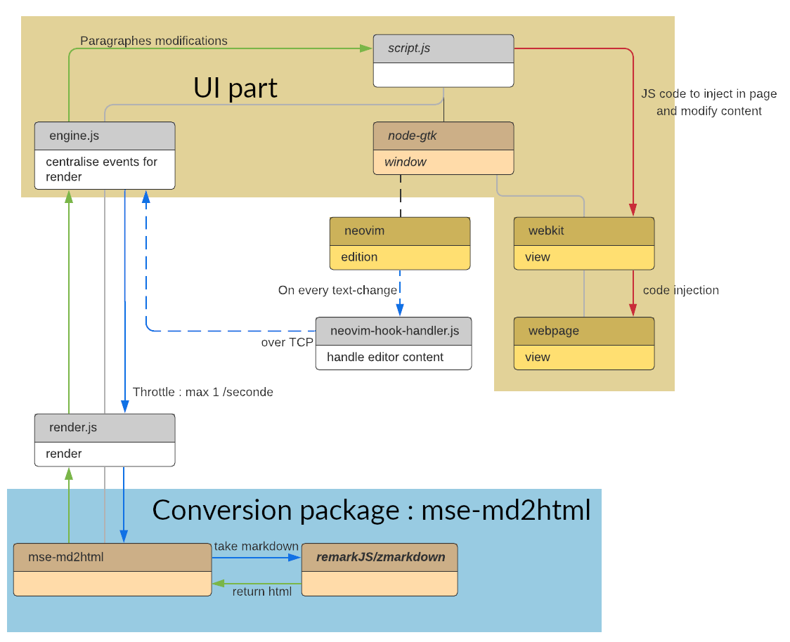

# markdown-math-editor
markdown editor using neovim as editor with lot of features like [asciiMath syntax](http://asciimath.org/) support, chemical molecule drawing (based on [SMILES syntax](https://fr.wikipedia.org/wiki/Simplified_Molecular_Input_Line_Entry_Specification))

## requierements

require `nodejs` 14, `neovim`, and other dependencies for running `node-gtk`
on _debian_ :
```bash
sudo apt-get install \
  build-essential git \
  gobject-introspection \
  libgirepository1.0-dev \
  libcairo2 \
  libcairo2-dev
apt-get install libwebkit2gtk-4.0
```
### other platform

take a look at [node-gtk install](https://github.com/romgrk/node-gtk#installing-and-building)

for the moment, it may not run well on other platforms, because of it's dependencies to GTK. It's on the roadmap.

## install

```bash
sudo npm install -g markdown-math-editor
```

then to open a file with the editor run :

```bash
markdown-math-editor file.md
```

You can configure your desktop manager to open all `*.md` files with this editor


## features

- Complexe math formule support with [asciiMath syntax](http://asciimath.org/) and with `$$` and `$` as delimiters
- Molecule drawing support with [SMILES syntax](https://fr.wikipedia.org/wiki/Simplified_Molecular_Input_Line_Entry_Specification) with `€€` and `€` as delimiters
- Simple and efficient Tables syntax
- Double click on a picture to edit in Gimp

## syntax

see (_in the editor_) [sample.md](sample.md)


## to use with

this editor was created to edit my University courses, which were in `odt` format. I've create this editor to work with this converter : https://github.com/Drulac/odt2md

## todo

add markdown syntax sample and explain

## contribute

This is a schematic explaining the current code functioning



### install for developpement

```bash
git clone https://github.com/Drulac/markdown-math-editor.git
cd markdown-math-editor
npm install
node script.js file.md
```

